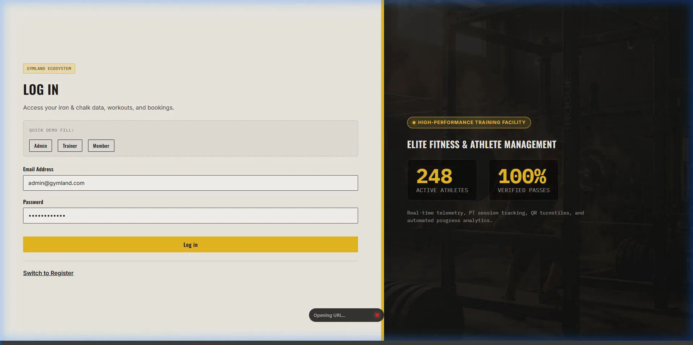
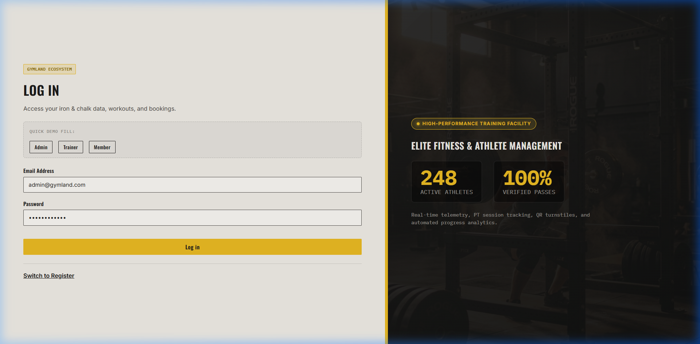
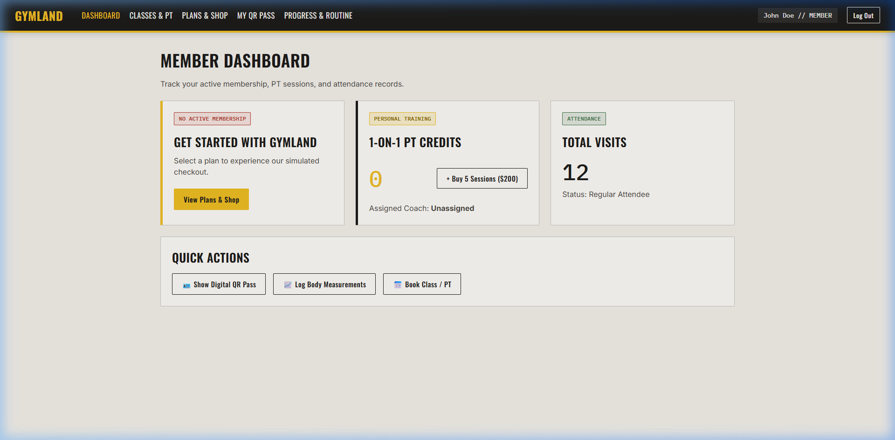
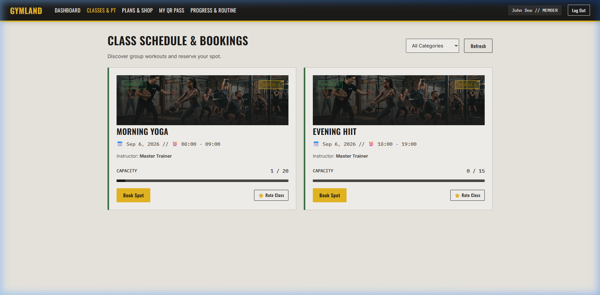
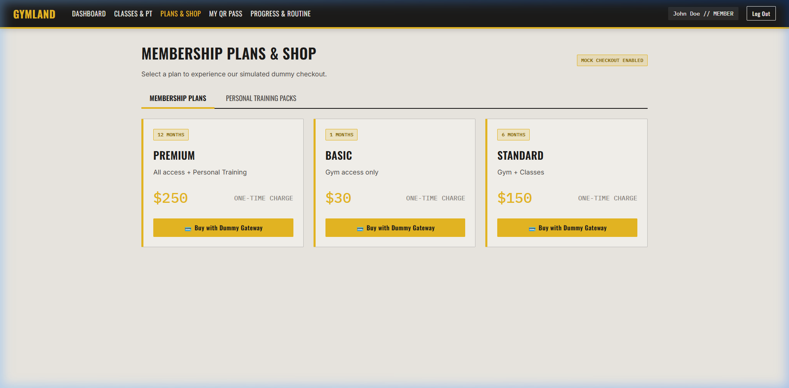
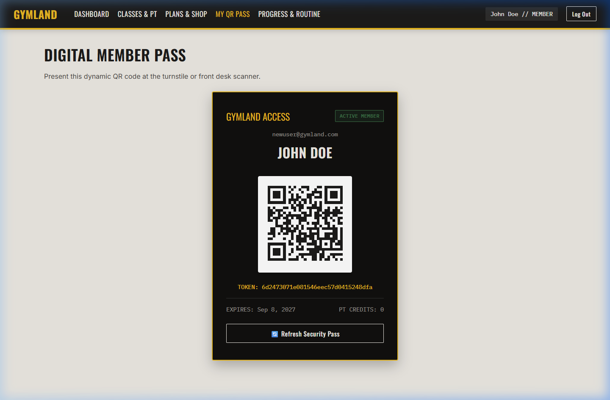
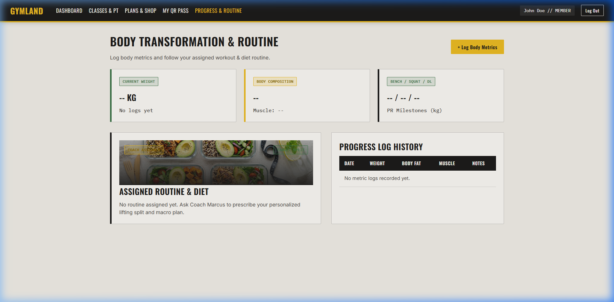
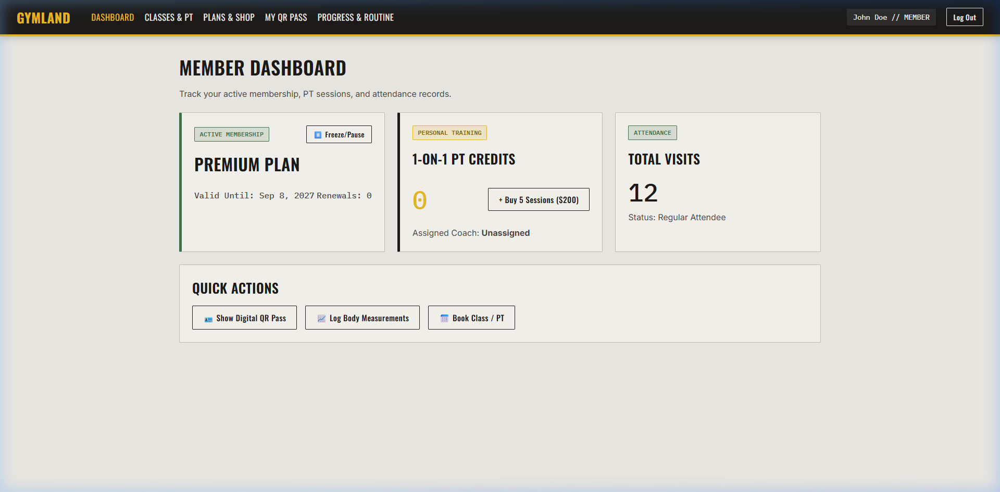

# Gym & Fitness Membership Management System

## Team Details
- **LAYA SHAJU** (2460397)
- **HARSHDEEP SHARMA** (2460370)
- **ABHISHAN FRANCIS** (2462835)

**Team Batch:** 16  
**Team Number:** 5

---

## Project Overview
The **Gym & Fitness Membership Management System** is a comprehensive, full-stack enterprise web application designed to handle the daily operations of a modern fitness center. Built with a Node.js/Express backend and an Angular frontend, it streamlines membership administration, class scheduling, trainer assignments, equipment tracking, and member progress logging.

---

## 📸 Application Demo & Screenshots

### 🎥 Interactive Browser Walkthrough


---

### 1. Authentication & Role-Based Onboarding
Dual authentication system with instant role demo quick-fills, password hashing, and JWT-backed session tokens.


---

### 2. Member Telemetry Dashboard
Real-time dashboard reflecting active membership tier, attendance counter, trainer balances, and quick actions.


---

### 3. Class Scheduling & Trainer Bookings
Interactive schedule with category filtering (Strength, Cardio, Yoga, HIIT), real-time capacity indicators, and instant spot reservations.


---

### 4. Membership Plans & Simulated Checkout
Transparent tiered pricing with live coupon code validation (`WELCOME50` for 50% discount) and simulated instant invoice generation.


---

### 5. Digital Turnstile QR Security Pass
Dynamic security QR token generator for contact-free entry turnstile scanning and automated attendance verification.


---

### 6. Body Transformation & Progress Tracker
Personal fitness metric logging with weight milestones, body fat analysis, and structured workout regime logging.


---

### 7. Real-Time Account Updates & Membership Lifecycle
Automated state updates reflecting upgraded memberships, extended validity dates, and instant membership freeze/unfreeze controls.


---

## Modules

- **Authentication & User Management:** Secure login and registration for Members, Trainers, and Branch Admins using role-based access control (RBAC).
- **Membership Management:** Purchase, renew, freeze, and unfreeze memberships based on different subscription plans.
- **Class & Booking Management:** Schedule classes, book sessions, manage cancellations, and handle waitlists automatically.
- **Attendance Tracking:** Real-time check-ins and QR code scanning for members and classes.
- **Trainer & Workout Management:** Assign personal trainers to members, track PT balance, and create/manage personalized workout plans.
- **Equipment Management:** Inventory tracking for gym equipment.
- **Payment & Transactions:** Mock checkout process, coupon validation, and payment history/ledger tracking.
- **Progress Tracking:** Members can log their fitness progress, including weight, body measurements, and fitness goals.
- **Notifications:** In-app notification system to alert users about membership expiries, class updates, and waitlist promotions.
- **Reviews & Ratings:** Members can submit reviews and rate trainers or classes.

---

## Technologies Used
- **Backend:** Node.js, Express.js, MongoDB (Mongoose)
- **Frontend:** Angular, TypeScript, RxJS
- **Authentication:** JWT (JSON Web Tokens)
- **Other:** Postman (for API testing and generation)

---

## Setup & Installation

### Prerequisites
- Node.js (v18+)
- Angular CLI (`npm install -g @angular/cli`)
- MongoDB (running locally or via MongoDB Atlas)

### Backend Setup
1. Clone the repository to your local machine.
2. Navigate to the root directory.
   ```bash
   cd GymLandT
   ```
3. Install the backend dependencies:
   ```bash
   npm install
   ```
4. Configure your environment variables (create a `.env` file based on your `config/db.js` requirements, adding MongoDB URI, JWT Secret, etc.).
5. Start the backend server:
   ```bash
   npm start
   ```
   *(Note: Ensure your package.json start script or main entry file like server.js/index.js is present and correctly mapped)*

### Frontend Setup
1. Navigate to the frontend directory:
   ```bash
   cd frontend-angular
   ```
2. Install frontend dependencies:
   ```bash
   npm install
   ```
3. Start the Angular development server:
   ```bash
   ng serve
   ```
4. Open your browser and navigate to `http://localhost:4200/`.

---

## API Testing (Postman)

A Postman collection is included for easy API testing and exploration. You can import the `postman/Gym-Management-API.postman_collection.json` file into your Postman app.

---

## Key API Endpoints

### Authentication & Users
- `POST /api/auth/register` - Register a new user
- `POST /api/auth/login` - Authenticate a user
- `GET /api/auth/me` - Get current user profile
- `PUT /api/auth/profile` - Update user profile

### Memberships & Plans
- `GET /api/plans` - View available membership plans
- `POST /api/memberships` - Purchase a membership
- `POST /api/memberships/:id/renew` - Renew membership
- `PUT /api/memberships/:id/freeze` - Freeze membership

### Classes & Bookings
- `GET /api/classes` - View scheduled classes
- `POST /api/classes/:id/book` - Book a class
- `POST /api/classes/:id/waitlist` - Join waitlist for a full class
- `GET /api/bookings/my` - Get current user's bookings
- `DELETE /api/bookings/:id` - Cancel a booking

### Attendance
- `POST /api/attendance/checkin` - Manual check-in
- `POST /api/attendance/scan-qr` - QR code check-in

### Trainers & Progress
- `GET /api/trainers` - List available trainers
- `POST /api/progress` - Log fitness progress
- `GET /api/progress/my` - View fitness progress history

### Admin (Branch Admin / Admin roles)
- `GET /api/admin/users` - List all users
- `PUT /api/admin/users/:id/assign-trainer` - Assign trainer to member
- `GET /api/admin/memberships` - View all memberships
- `POST /api/equipment` - Add new equipment

---

## Contribution Note
**Important:** Commit history should reflect contributions from multiple team members as per project requirements. All team members (Laya, Harshdeep, Abhishan) must actively push commits to the repository demonstrating their respective module ownership and involvement.
